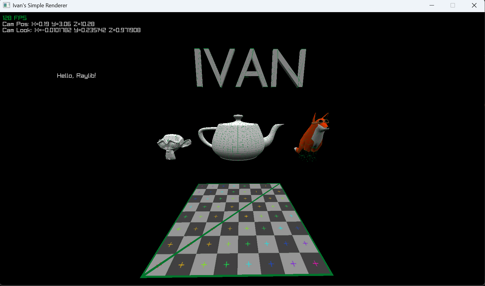

# SimpleRenderer

## Description
This is my simple renderer. I use RayLib to render a 3d scene using software rendering only.

## Motivation
This project is for learning purposes and not for production. I freely implement snippets, algorithms, and concepts I find interesting to learn more about rendering and the graphics pipeline. The project may include materials from other projects/books.

## Gallery
Below is an example of the program rendering a scene:

## Features
At the time of writing, the code supports rendering a scene object. The scene
may only contain 3d object loaded in from a .obj file as well as optional texture
files loaded in seperately.
### bulletin description
* **Rasterizes triangles** (according to barycentric coordinates instead of linescan)
* **Organizes Vertices into various "spaces"** (including object space, world space, view space, clip space, ndc space?, and screen space)
* **Matrix transformations** (describes converting matrices to screen based on their position)
* **Backface culling**
* **Clipping** (only for z)

